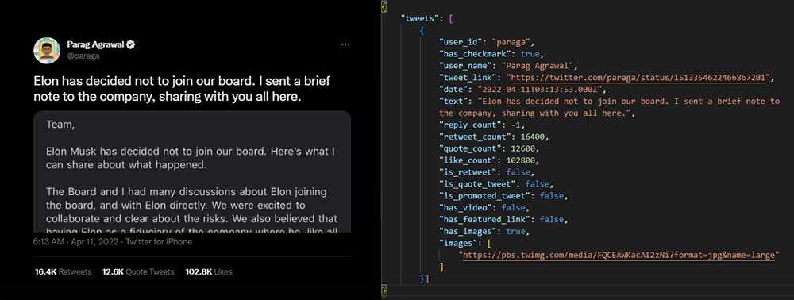

# SerializeThis

cli

> python ./twitter.py path <file_name.html>

get tweet array
>get_tweets(html_string) -> dictionary

get user bio
>get_bio(html_string) -> dictionary

serializes html files of social media sites to json format

